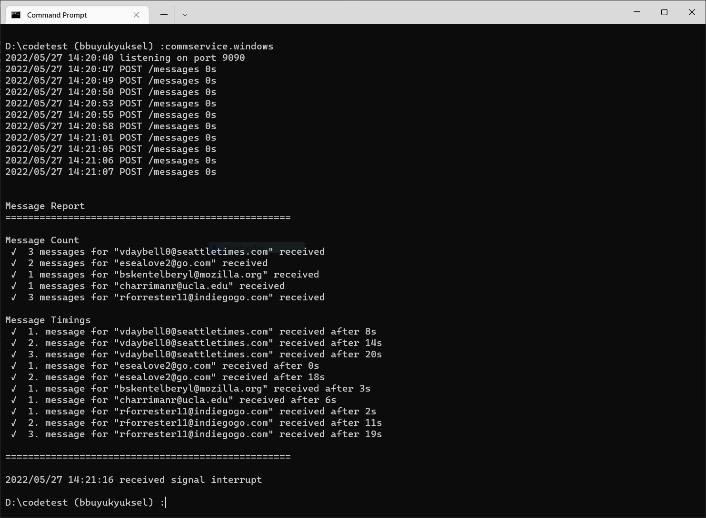

# Documentation

## Overview

This project's aim to parse `customer informations` which is been CSV file contents and send `post-request` with schedule offsets until response includes `paid=true` information.

## Index

- func PrintCustomerArray(o []*Customer)

- func createCustomers(data [][]string) []Customer

- type CSV
  
  - customers []Customer
  - func (ptr *CSV) Parse(filename string)
  - func (ptr *CSV) Sort()
  - func (ptr *CSV) Filter()
  - func (o CSV) GetAllScheduleList() []int
  - func (ptr *CSV) GetByLastNTime(last_n_time time.Duration, start_time time.Time) []*Customer
  - func (o CSV) Print()

- Handler(csv *CSV)

- PostRequest(customer []*Customer)
  
## Results

